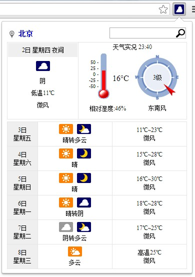

WeaBot
===

A weather report plugin for Chrome. 
Using data from www.weather.com.cn. The data source covers China, including Taiwan.

**Install:**

You can download the extension from https://code.google.com/p/weabot/downloads/list.

Open your Chrome, and input chrome://extensions/

And as it is not published in Chrome Store yet, you can install it by drag the extension file to this page to install it.

Features:
======
1. Weather report for 6 days
2. Realtime weather information ( China mainland only )
3. Location detect by IP address
4. Search cities
5. Notification for weather alerts 

Here is how it looks:

